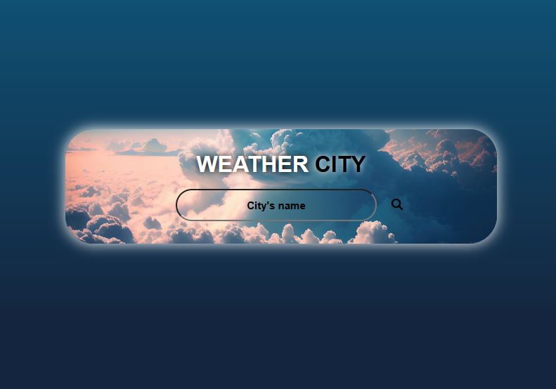
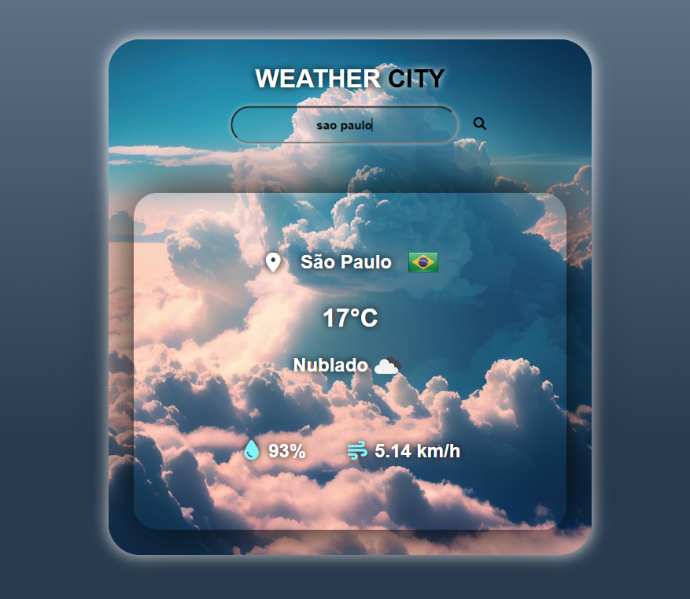

<h1 align='center'>
    WEATHER CITY
</h1>

## 📕 About

**WEATHER CITY** is a project where you can check the weather of any city in the world.

## 📌 Programming Languages ##

- JavaScript
- CSS
- HTML

## 🛠 Tools ##

- API weather
- API country flag

## 🖥️ Preview ##

 

    

  

    

 

## 🌐 Link ##

- [WEATHER CITY](https://weathercitypage.netlify.app/)

